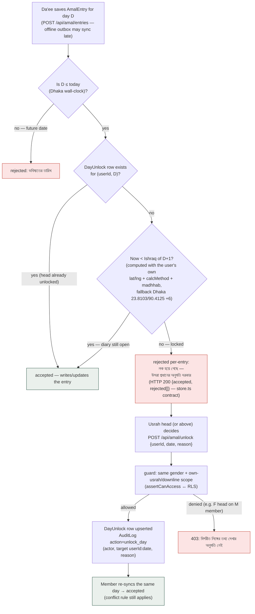

# Sunnah Life — Data Model (DATA_MODEL.md)

**Authoritative schemas**

| Surface | Schema | Notes |
|---|---|---|
| Production (NestJS API + worker) | `apps/api/prisma/schema.prisma` — **PostgreSQL 16 + RLS** | 22 models (incl. `RefreshToken`); migrations in `apps/api/prisma/migrations/` |
| Web PWA mirror | `prisma/schema.prisma` (repo root) — **SQLite** | same shape minus `RefreshToken` (the web mirror uses HttpOnly session cookies); kept in sync by the shared field naming |

All examples below use the PostgreSQL schema names (quoted "PascalCase" tables,
matching the Prisma migrations). The SQLite mirror uses identical model
names/fields; only column types differ where SQLite requires strings for dates.

---

## 1. Entity-Relationship Diagram (all 22 models)

```mermaid
erDiagram
    %% ───────── Identity & program ─────────
    USER {
        string id PK "cuid"
        string phone UK "nullable — OTP identity"
        string email "nullable"
        string name
        string photoUrl "nullable"
        string gender "M · F — set at onboarding, changed only by full_admin"
        string role "user · daee · usrah_head · invigilator · full_admin"
        string category "general · hafez · alim — tilawat target tier"
        string memberCode UK "DS-000004 — assigned on promotion to da'ee"
        string referredById FK "nullable — direct inviter"
        string usrahId FK "nullable — accountability group"
        string level "none · muhibbus_sunnah · farze_ain_1 · farze_ain_2"
        datetime levelStartedAt
        string district
        string workplace
        string department
        string language "bn default"
        string madhhab "hanafi default"
        string calcMethod "karachi default"
        float lat
        float lng
        string city
        datetime createdAt
        datetime lastActiveAt
    }
    SESSION {
        string id PK "opaque token, HttpOnly cookie"
        string userId FK
        datetime createdAt
        datetime expiresAt
    }
    REFRESH_TOKEN {
        string id PK
        string userId FK
        string familyId "rotation family — revoked as a whole on reuse"
        string tokenHash UK "sha256 of the issued refresh JWT"
        datetime expiresAt
        datetime usedAt "first use; a second use = replay → family revoked"
        datetime revokedAt
        datetime createdAt
    }
    OTP_CODE {
        string id PK
        string phone
        string code "6 digits, hashed at rest in production"
        int attempts
        datetime createdAt
        datetime expiresAt
    }
    REFERRAL_CLOSURE {
        string id PK
        string ancestorId FK
        string descendantId FK
        int depth "1 = direct, 2..3 = downline tiers"
        datetime createdAt
    }
    USRAH {
        string id PK
        string name
        string gender "equals head's and all members'"
        string headUserId UK "nullable"
        string invigilatorUserId "nullable"
        string district
        datetime createdAt
    }

    %% ───────── Muhasaba diary ─────────
    AMAL_DEFINITION {
        string id PK
        string key UK "e.g. tahajjud, tilawat"
        string titleBn
        string titleEn
        string category "salah · quran · dhikr · akhlaq · dawat · lifestyle · sunnah"
        string inputType "tristate · boolean · count · quantity · text"
        string cadence "daily · weekly:fri · weekly:mon_thu · monthly:ayyam_beez"
        string targetJson "per-category targets + unit"
        string unit "পৃষ্ঠা / পারা / মিনিট / টি"
        string minLevel "none default"
        int sortOrder
        string autoSource "auto:adhkar:morning · auto:quran:tilawat · auto:prayer:fajr …"
        boolean active
    }
    AMAL_ENTRY {
        string id PK
        string userId FK
        string amalKey "→ AMAL_DEFINITION.key (logical, no FK)"
        string date "YYYY-MM-DD — natural key part"
        string hijriDate "e.g. 1446-12-10"
        string valueJson "tristate jamaat·alone·qaza · boolean · count · quantity"
        string source "manual · auto:<feature>"
        datetime clientUpdatedAt "conflict winner (latest wins)"
        datetime serverUpdatedAt
    }
    DAY_UNLOCK {
        string id PK
        string userId FK "unlocked for"
        string date "YYYY-MM-DD"
        string byUserId FK "unlocked by (usrah_head+)"
        string reason
        datetime createdAt
    }
    PERSONAL_GOAL {
        string id PK
        string userId FK
        string amalKey
        string title
        string note "reviewer notes"
        string target "free-form target description"
        string startDate "YYYY-MM-DD"
        boolean active
        datetime createdAt
    }

    %% ───────── Reviews & assessment ─────────
    WEEKLY_REVIEW {
        string id PK
        string userId FK "reviewee"
        string reviewerId FK
        string weekStart "Saturday, BD week convention"
        string summaryJson "auto: per-category %, streaks, missed days"
        string comment
        int rating "1..5"
        string nextGoals
        string status "pending · done · overdue"
        datetime createdAt
        datetime completedAt
    }
    ASSESSMENT_TEMPLATE {
        string id PK
        string key UK "farze_ain_v1"
        int version
        string titleBn
        string titleEn
        string sectionsJson "23 criteria: Iman 5, Ilm 5, Ibadat 6, Akhlaq 7"
        datetime createdAt
    }
    ASSESSMENT {
        string id PK
        string templateKey "→ ASSESSMENT_TEMPLATE.key (logical)"
        string assesseeId FK
        string assessorId FK
        int participantCategory "1 beginner 45–60 min/day · 2 advanced 60–90"
        string scoresJson "criterionKey → {score 0·1·2, comment?}"
        string overallComment
        datetime assessorSignedAt "dual digital signature"
        datetime assesseeSignedAt "OTP-confirmed"
        string result "passed · not_yet"
        datetime createdAt
    }
    LEVEL_TRANSITION {
        string id PK
        string userId
        string fromLevel
        string toLevel
        datetime at
        string evidenceJson "{assessmentId, monthsInLevel, referralsAtLevel}"
    }

    %% ───────── Content & engagement ─────────
    ANNOUNCEMENT {
        string id PK
        string usrahId FK "nullable = global"
        string authorId FK
        string kind "announcement · question · exam"
        string body
        boolean pinned
        datetime createdAt
    }
    REMINDER {
        string id PK
        string userId FK
        string kind "prayer · review · broadcast · live · goal · detox"
        string title
        string body
        string link "app subview hint"
        datetime scheduledAt
        boolean read
        datetime createdAt
    }
    AUDIT_LOG {
        string id PK
        string actorId "nullable — system"
        string action "unlock_day · change_role · change_gender · promote_level · broadcast · sign_assessment"
        string targetType
        string targetId
        string metaJson
        datetime createdAt
    }
    MASALA_QUESTION {
        string id PK
        string userId FK "nullable — guests may ask"
        string name
        string phone
        string question
        string status "new · answered"
        string answer
        datetime createdAt
    }
    FEEDBACK {
        string id PK
        string userId FK "nullable — guests may send"
        string message
        datetime createdAt
    }
    LIVE_PROGRAM {
        string id PK
        string titleBn
        string descBn
        string hostName
        datetime startsAt
        datetime endsAt
        string youtubeId "unlisted embed — F sessions never public"
        string gender "M · F audience scope"
        string status "upcoming · live · past"
        string recordingUrl
        datetime createdAt
    }
    ENROLLMENT {
        string id PK
        string userId FK
        string courseId "→ content/courses.json id (logical)"
        string progressJson "{lessonIndex, completed:[]}"
        datetime updatedAt
    }
    QUIZ_ATTEMPT {
        string id PK
        string userId FK "nullable — guests store locally only"
        string quizId "→ content/quizzes.json id (logical)"
        int score
        int total
        datetime createdAt
    }

    %% ───────── Relationships ─────────
    USER ||--o{ SESSION : "opens"
    USER ||--o{ REFRESH_TOKEN : "rotates"
    USER ||--o{ AMAL_ENTRY : "writes"
    USER ||--o{ PERSONAL_GOAL : "sets"
    USER ||--o{ DAY_UNLOCK : "is unlocked for"
    USER ||--o{ DAY_UNLOCK : "unlocks (usrah_head+)"
    USER ||--o{ WEEKLY_REVIEW : "is reviewed in"
    USER ||--o{ WEEKLY_REVIEW : "reviews (head/invigilator)"
    USER ||--o{ ASSESSMENT : "is assessed (assessee)"
    USER ||--o{ ASSESSMENT : "assesses (assessor)"
    USER ||--o{ LEVEL_TRANSITION : "is promoted"
    USER ||--o{ ANNOUNCEMENT : "authors"
    USER ||--o{ REMINDER : "receives"
    USER |o--o{ MASALA_QUESTION : "asks"
    USER |o--o{ FEEDBACK : "sends"
    USER ||--o{ ENROLLMENT : "enrolls"
    USER |o--o{ QUIZ_ATTEMPT : "attempts"
    USER |o--o{ USER : "referred by"
    USER |o--o| USRAH : "heads (headUserId, unique)"
    USER |o--o{ USRAH : "invigilates"
    USRAH ||--o{ USER : "has members"
    USRAH |o--o{ ANNOUNCEMENT : "scopes"
    USER ||--o{ REFERRAL_CLOSURE : "is ancestor of"
    USER ||--o{ REFERRAL_CLOSURE : "is descendant of"
    ASSESSMENT_TEMPLATE ||--o{ ASSESSMENT : "keyed by (templateKey)"
    AMAL_DEFINITION ||--o{ AMAL_ENTRY : "keyed by (amalKey, logical)"
```

Notes on relationships drawn without a foreign key (Prisma-level, enforced by
the unique keys + application logic):

- `AMAL_ENTRY.amalKey → AMAL_DEFINITION.key`
- `ASSESSMENT.templateKey → ASSESSMENT_TEMPLATE.key`
- `ENROLLMENT.courseId` / `QUIZ_ATTEMPT.quizId` → ids inside the versioned
  content packs (`packages/content/courses.json`, `quizzes.json`)
- `REMINDER.link` names a store view (e.g. `"dawah"`, `"amal"`)

---

## 2. Natural keys & uniqueness rules

| Table | Natural key / unique | Meaning |
|---|---|---|
| `User` | `phone` (unique, nullable) · `memberCode` (unique) | one account per phone; member code minted on da'ee promotion (`DS-000001…`) |
| `Session` | `id` = the opaque session token | cookie value is the PK — no lookup table |
| `RefreshToken` | `tokenHash` (sha256) | raw JWT never stored; reuse detection by family |
| `ReferralClosure` | `(ancestorId, descendantId)` | closure table — one row per ancestor/descendant pair |
| `Usrah` | `headUserId` (unique) | a user heads at most one usrah |
| `AmalDefinition` | `key` | catalog identity across content-pack versions |
| `AmalEntry` | **`(userId, amalKey, date)`** | one value per amal per day — the diary cell |
| `DayUnlock` | `(userId, date)` | one unlock per member-day |
| `WeeklyReview` | `(userId, weekStart)` | one review per member per week (Saturday start) |
| `AssessmentTemplate` | `key` (+ `version`) | versioned templates |
| `Enrollment` | `(userId, courseId)` | one enrollment per course |
| `OtpCode` | `(phone)` latest + `expiresAt` | rate-limited 3 per 10 min per phone |

---

## 3. The Muhasaba locking rule (paper-diary emulation)

A day's diary is open for editing until **Ishraq (sunrise + 20 min) of the next
day** — like a paper diary that is closed once the morning after has begun.
After that the day is **locked**, and only a supervisor (usrah head and above)
can reopen it, which is **audit-logged**.

Conflict rule on every accepted write: **latest `clientUpdatedAt` wins** — a
stale sync arriving after an edit is rejected with
`"নতুন সংস্করণ আছে"`; guest-diary entries merge into the account at OTP-verify
using the same rule.

---

## 4. Row-Level Security (PostgreSQL production database)

**This is the crown jewel of the privacy design**: female members' rows are
unreadable by male accounts *at the database level*, not merely by application
filters. A query executed with a female head's session cannot return male rows
even if the code forgets a `where` — proven by the e2e test
(`apps/api/test` RLS gender-isolation spec) and mirrored logically in the web
SQLite surface by `assertCanAccess` (`src/lib/server/guard.ts`).

### 4.1 Session GUCs — set per request

Every API request runs inside a transaction that first sets (with
`set_config(..., is_local := true)` — resets on commit):

| GUC | Values | Meaning |
|---|---|---|
| `app.user_id` | cuid · `''` anonymous | acting user |
| `app.gender` | `M` · `F` · `''` | acting user's gender |
| `app.usrah_id` | cuid · `''` | acting user's own usrah |
| `app.role` | `user` \| `daee` \| `usrah_head` \| `invigilator` \| `full_admin` \| `system` | acting role; `system` = trusted server bootstrap context (auth/worker) |

### 4.2 Policy matrix (apps/api/prisma/migrations/*_rls — authoritative)

All policies are `CREATE POLICY … USING (…) WITH CHECK (…)` with **FORCE ROW
LEVEL SECURITY**. Two `SECURITY DEFINER` helpers avoid recursion:
`sl_visible_user(uid)` and `sl_visible_usrah(usid)` implement the
`assertCanAccess` matrix (full_admin/system → all; else same gender AND self /
own-usrah-or-headed / invigilator / downline via `ReferralClosure`).

| Table | RLS | Policy (USING = WITH CHECK) |
|---|---|---|
| `User` | ✅ FORCE | self · full_admin/system · same-gender invigilator · same usrah · headed-usrah member · downline |
| `Session` | ✅ FORCE | own (`userId = app.user_id`) · full_admin/system |
| `RefreshToken` | ✅ FORCE | own · full_admin/system |
| `OtpCode` | — | no RLS: public write path (hashed codes, rate-limited); never returned to clients in production |
| `ReferralClosure` | ✅ FORCE | full_admin/system · ancestor = me (my madu tree) · `sl_visible_user(descendantId)` |
| `Usrah` | ✅ FORCE | own usrah · I head it · same-gender invigilator · full_admin/system (WITH CHECK: full_admin/system only) |
| `AmalDefinition` | — | public read (catalog); writes via full_admin API + audit |
| `AmalEntry` | ✅ FORCE | `sl_visible_user(userId)` |
| `DayUnlock` | ✅ FORCE | `sl_visible_user(userId)` |
| `PersonalGoal` | ✅ FORCE | `sl_visible_user(userId)` |
| `WeeklyReview` | ✅ FORCE | full_admin/system · `sl_visible_user(userId)` · reviewer = me |
| `AssessmentTemplate` | — | public read (templates) |
| `Assessment` | ✅ FORCE | full_admin/system · `sl_visible_user(assesseeId)` · assessor = me |
| `LevelTransition` | ✅ FORCE | full_admin/system · `sl_visible_user(userId)` |
| `Announcement` | ✅ FORCE | `sl_visible_usrah(usrahId)` — global announcements (usrahId NULL) visible to all |
| `Reminder` | ✅ FORCE | `sl_visible_user(userId)` — same matrix as the diary (supervisors see their members' reminders) |
| `AuditLog` | — | append-only; read via full_admin API endpoint only |
| `MasalaQuestion` | — | public submit (guests allowed); answered by admins |
| `Feedback` | — | public submit (guests allowed) |
| `LiveProgram` | — | API filters female programs to F users only; `gender` column is the scope |
| `Enrollment` | ✅ FORCE | own · full_admin/system |
| `QuizAttempt` | ✅ FORCE | own · full_admin/system |

### 4.3 Role & grant bootstrap (who may connect as what)

| Connection | Role | RLS |
|---|---|---|
| API runtime (`DATABASE_URL`) | `sunnah_app` | `NOBYPASSRLS NOSUPERUSER NOCREATEDB NOCREATEROLE NOREPLICATION` — RLS always applies |
| Migrations + seed (`DIRECT_URL`) | `postgres` (owner) | bypasses RLS by design; owner of the tables |
| Worker (BullMQ) | `sunnah_app` via `app.role='system'` GUCs for bootstrap contexts | RLS applies |

The `sunnah_app` role is created at **first database initialisation** by
`infra/postgres/init-rls.sql` (mounted at
`/docker-entrypoint-initdb.d/10-rls.sql`, idempotent `DO $$` blocks + `psql
\getenv` for the env-injected password). The API's own `*_rls` migration
re-grants on its created tables and adds the policies above — the two files are
deliberately complementary, never conflicting (both are no-ops when the other
already ran).

---

## 5. Gender privacy summary (enforced twice)

1. **Database**: RLS policies above — a female head's session physically cannot
   read male rows; `full_admin` and same-gender `invigilator` are the only
   cross-usrah exceptions, by design.
2. **API surface** (web mirror): `assertCanAccess(viewer, targetId)` in
   `src/lib/server/guard.ts` — the same matrix expressed in TypeScript, so the
   SQLite-backed web PWA behaves identically.

Additional privacy rails: female live sessions are never public on YouTube
(`LiveProgram.gender='F'` + app-only links); audit-logged gender/role changes
(`AuditLog.action = change_gender | change_role`); female users see a trust note
at onboarding.

---

## 6. Content packs vs. database tables

Static reference content lives in **versioned JSON packs**
(`packages/content/*.json`, served through `packages/design-tokens`-style
versioning + MinIO object storage), NOT in Postgres: Qur'an (114 surahs +
Bengali translation), du'as, adhkar sets, 99 names, Islamic names, 70 branches
of Iman, sunnahs, articles, courses, quizzes, mosques, FAQ, level rules.
Database tables cover only **user data** and **configurable program data**
(`AmalDefinition`, `AssessmentTemplate`, `LiveProgram`, `Announcement` …) —
this keeps the database small and the packs offline-cacheable in the apps.
